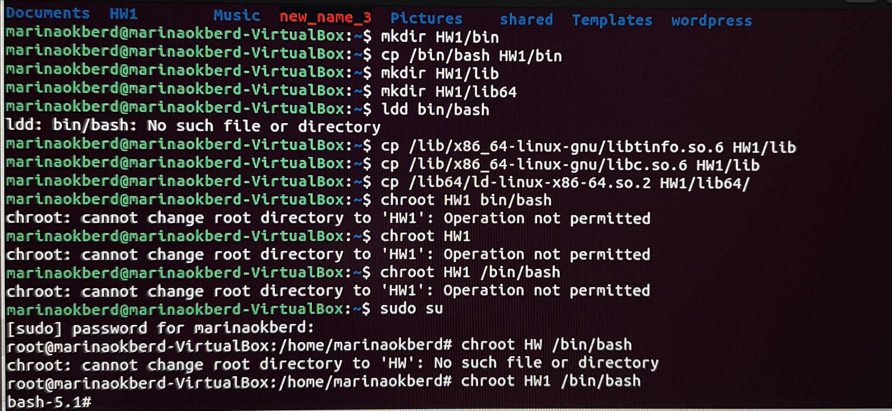
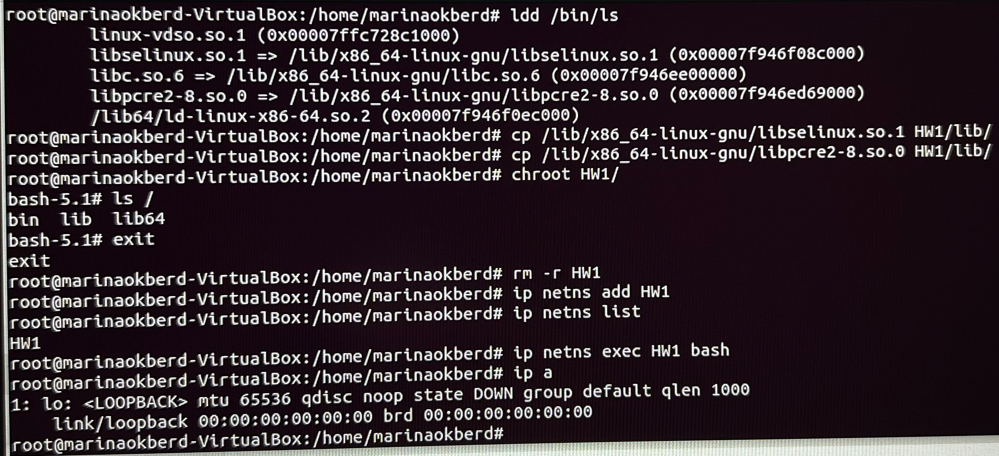
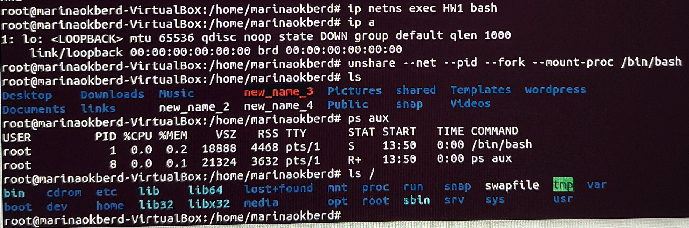

# ДЗ 1 Бердникова Марина группа 3366
## Изменение корневый папки.
* mkdir HW1 
* mkdir HW1/bin
* cp /bin/bash HW1/bin
* mkdir HW1/lib
* mkdir HW1/lib64
* ldd /bin/bash
* cp /lib/x86_64-linux-gnu/libtinfo.so.6 HW1/lib
* cp /lib/x86_64-linux-gnu/libc.so.6 HW1/lib
* cp /lib64/ld-linux-x86-64.so.2 HW1/lib64/
* sudo su
* chroot HW1 /bin/bash

## Копирование библиотек. Создание нового пространства имен. 
* cp /bin/ls HW1/bin/
* ldd /bin/ls
* cp /lib/x86_64-linux-gnu/libselinux.so.1 HW1/lib/
* cp /lib/x86_64-linux-gnu/libpcre2-8.so.0 HW1/lib/
* chroot HW1/
* exit
* rm -r HW1
* ip netns add HW1
* ip netns list
* ip netns exec HW1 bash
* ip a

## Создание нового изолированного процесса, выведение списка текущих процессов и списка в изолированной среде.
* unshare --net --pid --fork --mount-proc /bin/bash
* ls
* ps aux
* ls /
