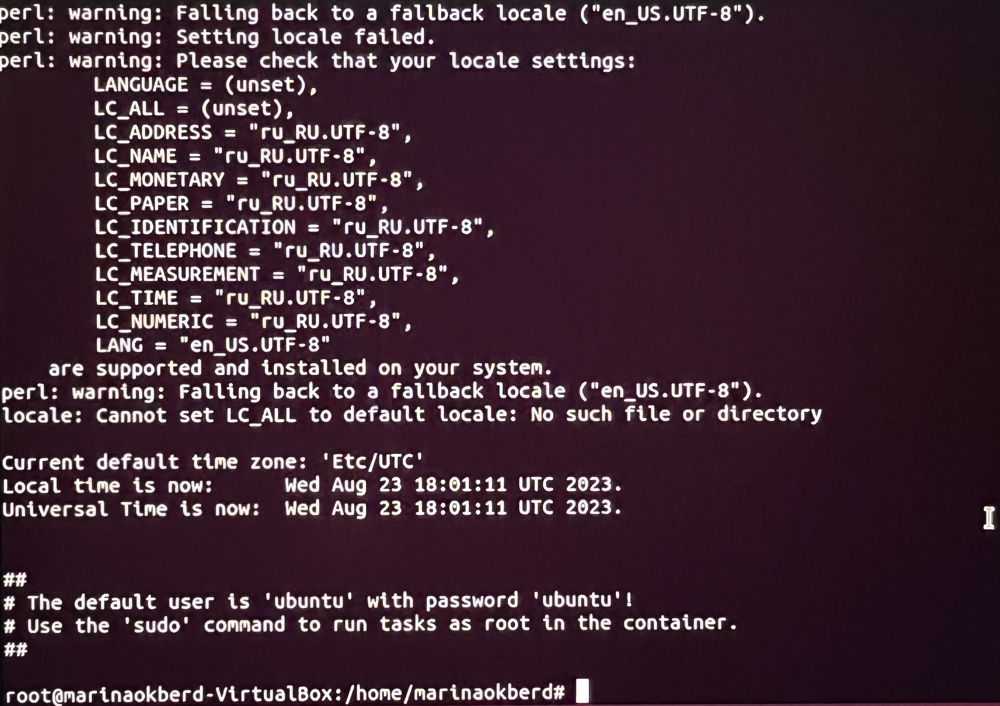

# Создание контейнера.
* sudo su
* apt-get install lxc debootstrap bridge-utils lxc-templates
* apt-get install lxd-installer
* apt install lxc-utils
* lxd init
* lxc-create -n test123 -t ubuntu -f /usr/share/doc/lxc/example/lxc-veth.conf
* lxs storage list
* lxc network list
* lxc-start -n test123
* lxc-attach -n test123
* lxc-stop -n test123

# Внесение ограничения для контейнера (256 Мб ОЗУ).
* nano /var/lib/lxc/test123/config
```
lxc.cgroup2.memory.max = 256M
```
* free -m
