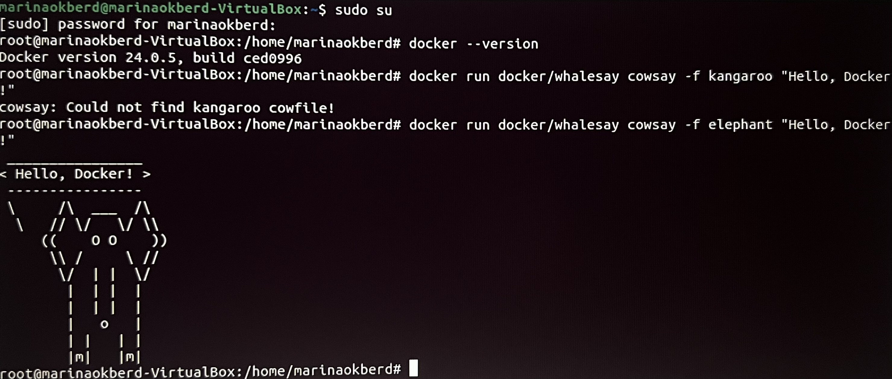
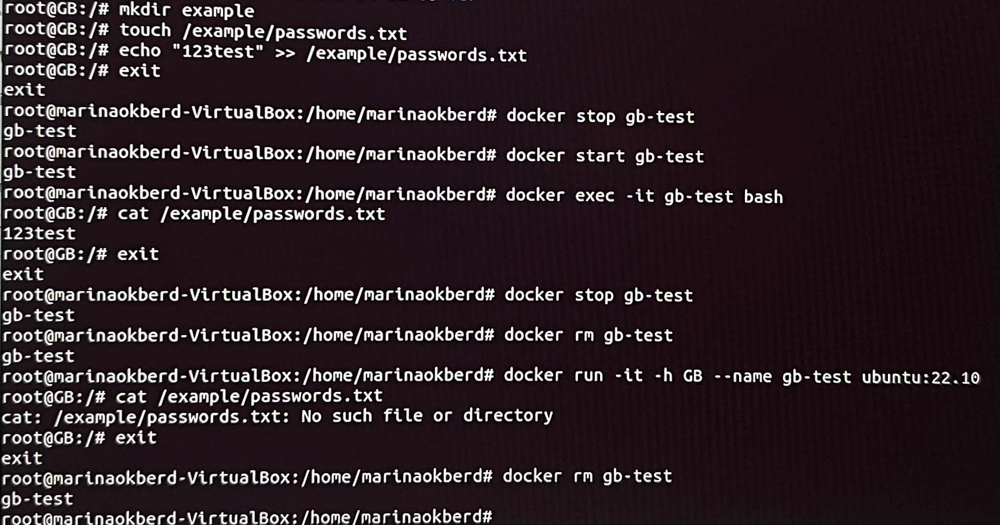
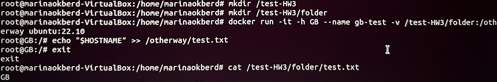
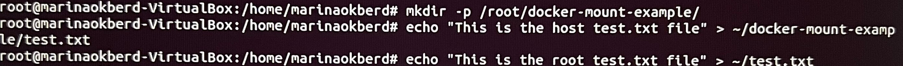
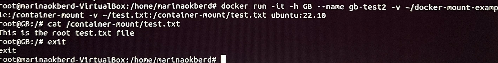

## Обновление пакетов. Установка Docker.
* sudo su
* apt update
* apt install apt-transport-https ca-certificates curl software-properties-common
* curl -fsSL https://download.docker.com/linux/ubuntu/gpg | sudo gpg --dearmor -o /usr/share/keyrings/docker-archive-keyring.gpg
* echo "deb [signed-by=/usr/share/keyrings/docker-archive-keyring.gpg] https://download.docker.com/linux/ubuntu $(lsb_release -cs) stable" | sudo tee /etc/apt/sources.list.d/docker.list > /dev/null
* apt update
* apt install docker-ce
* usermod -aG docker $USER
* newgrp docker
* docker --version
* systemctl start docker
* docker run docker/whalesay cowsay -f elephant "Hello, Docker!"

## Хранение данных в контейнерах Docker.
* docker run -it -h GB --name gb-test ubuntu:22.10
* ls -l
* mkdir /example
* touch /example/passwords.txt
* echo "123test" >> /example/passwords.txt
* docker stop gb-test
* docker start gb-test
* docker exec -it gb-test bash
* cat /example/passwords.txt
* docker stop gb-test
* docker rm gb-test
* docker run -it -h GB --name gb-test ubuntu:22.10
* cat /example/passwords.txt

* mkdir /test-HW3
* mkdir /test-HW3/folder
* docker run -it -h GB --name gb-test -v /test-HW3/folder:/otherway ubuntu:22.10
* echo "$HOSTNAME" >> /otherway/test.txt
* cat /test-HW3/folder/test.txt

* mkdir -p /root/docker-mount-example/
* echo "This is the host test.txt file" > ~/docker-mount-example/test.txt
* echo "This is the root test.txt file" > ~/test.txt

* docker run -it -h GB --name gb-test2 -v ~/docker-mount-example:/container-mount -v ~/test.txt:/container-mount/test.txt ubuntu:22.10
* cat /container-mount/test.txt
