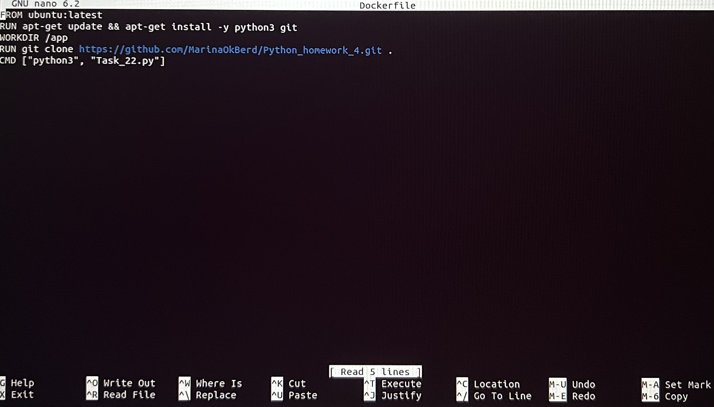
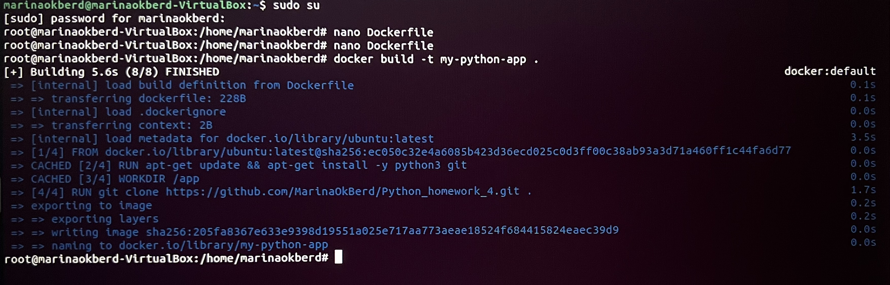
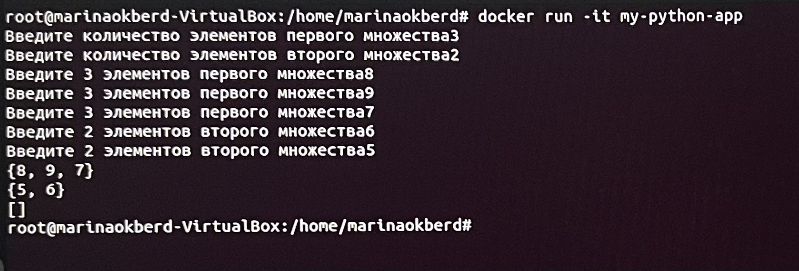

## Создание Dockerfile.
* sudo su
* nano Dockerfile
```
FROM ubuntu:latest
RUN apt-get update && apt-get install -y python3 git 
WORKDIR /app
RUN git clone https://github.com/MarinaOkBerd/Python_homework_4.git .
CMD ["python3", "Task_22.py"]
```

## Сборка образа my-python-app по Dockerfile.
* docker build -t my-python-app .

## Запуск контейнера my-python-app.
* docker run -it my-python-app

