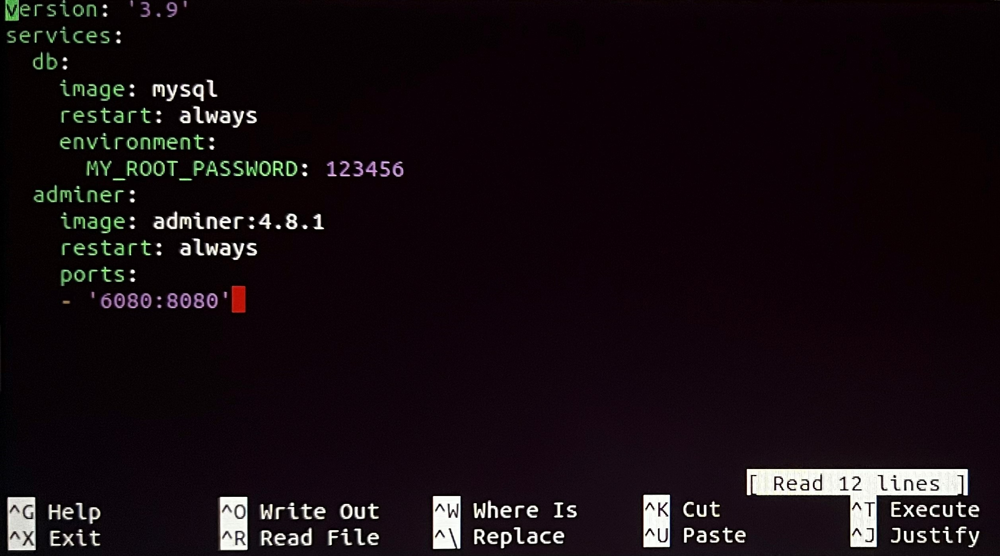
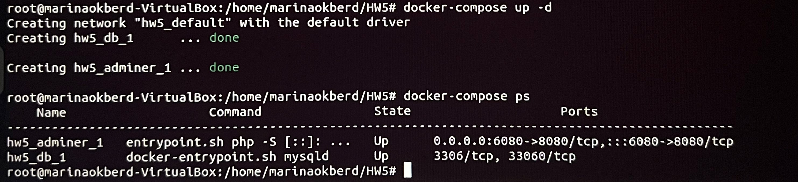
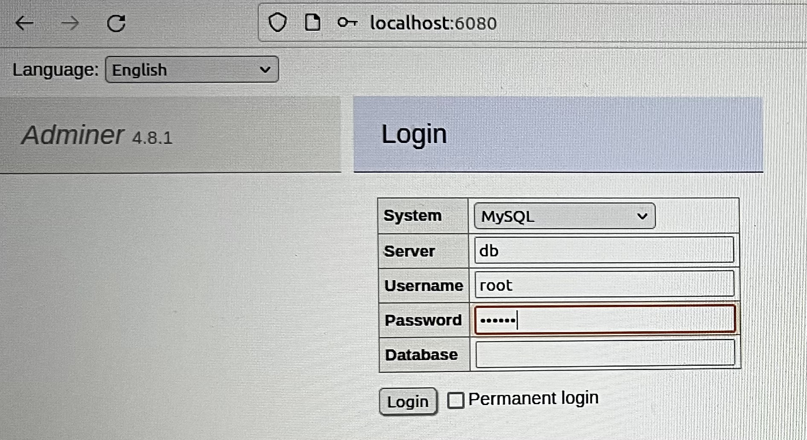

## Создание docker-compose.yml файла.
* sudo su
* mkdir HW5
* cd HW5
* nano docker-compose.yml

## Запуск контейнера.
* docker-compose up -d
* docker-compose ps

## Проверка работы.
* http://localhost:6080/
